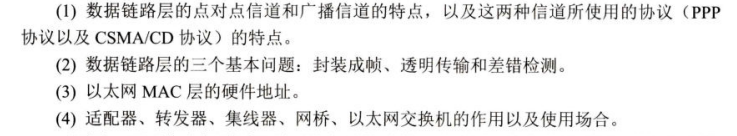
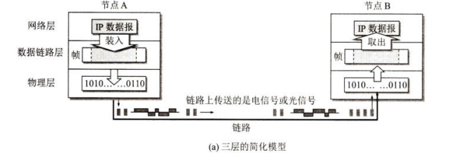
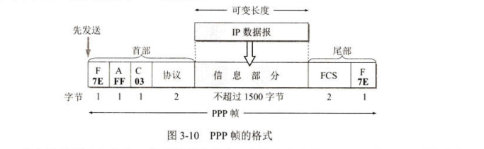

# chapter 3 链路层

数据链路 ： 

数据链路是实现数据传输协议的硬件和软件加到物理传输链路上，总称为数据链路。

网络适配器 ：
包含软硬件，实现数据传输的协议，包含了数据链路层和物理层两个功能。

# 点对点信道

基本工作流程：

在这个过程中，数据链路层承担如下工作：

1. 数据封装 将网络层中的数据封装成数据帧
2. 数据传输 将数据帧通过链路传输到目标节点
3. 数据检验 目标节点的链路层会对数据帧进行检验，并将数据帧还原为数据交给网络层

上述三个基本工作也对应相关的协议。

## 封装成帧 
在数据中加入头部和尾部，用于标识帧的开始和结束。同时存在MTU（最大传输单元）的限制，即一个数据帧中最多能传输多少字节的数据。（不包括头尾）

控制字符SOH 表示帧的开始 ，EOT 表示帧的结束，他们位于头部和尾部。

## 透明传输 

指网络层的数据可以透过数据链路层，而不在意数据具体的内容，即便数据中EOT这样的帧结束符也能被正确传输。

实现的一个手段是字节填充，在与控制字符相同的数据前加上**转义字符ESC**，而在数据接收后删除转义字符。

## 差错检测

### 误码率 BER 
### 循环冗余校验 CRC

当得到的余数等于0时，CRC校验通过。

对于质量好的传输链路，我们不使用确认和重机制，即不要求数据链路层向上提供可靠的传输服务，如果出现了差错，由上层协议来处理。

但是对于不太可靠的链路，我们需要使用确认和重传机制来确保可靠的传输服务 

# 3.2 点对点协议PPP

## 3.2.2 PPP协议的帧格式 

1. 特殊字段 
小于Ox20 均认为是控制字符
7e 标识帧的开始
fcs（帧检验序列）用于检验数据是否被破坏。

2. 字节填充（异步传输：一个个字符传输）
3. 零比特填充（同步传输：一整块数据一起传输）
