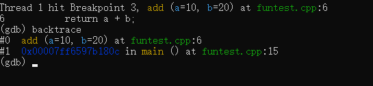
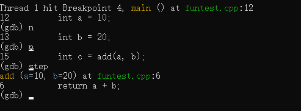
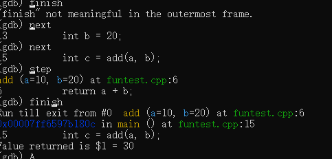
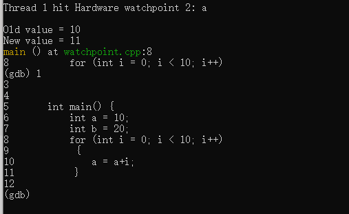
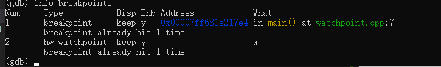

# Learning GDB

## 1 start a gdb session

我们在命令行中输入
```
g++ -g -std=c++14 basic1.cc -o basic1
gdb ./basic1
```


第一行代码使得编译生成的可执行文件可以支持调试，第二行代码启动gdb调试器，并指定要调试的可执行文件。


## 2 set breakpoints


我们可以设置断点，在程序运行到断点处停下来，可以查看变量的值，或者进行单步调试。

```
break 12
run
```

设置断点的命令是`break`，后面跟着行号。运行程序的命令是`run`。

break 也可以设置条件断点，比如只在变量a大于10时停下来。

```
break 12 if a > 10
run
```

break 后面可以跟具体函数名，例如 


```
break main
run
```


## 3 examine variables

我们可以查看变量的值。


```
print a
```

## 4 quit gdb

退出gdb的命令是`quit`。 

```
quit
```

---

进一步的深入

## 5 display 命令 

当我们想跟踪某个变量的变化时，如果next一次就print一次很麻烦，这个时候使用display命令可以候自动打印变量的值。

```
display a
run
next
next
```

## 6 up & down 命令

我们知道程序的函数调用是一个栈结构，我们可以用up和down命令来切换函数栈。

up命令会将当前帧移动到调用栈中的上一级，即进入调用该函数的函数的堆栈帧。
 
down命令则将当前帧移动到调用栈中的下一级，即回到被当前函数调用的函数的堆栈帧。

```
up
down
```

## 7 backtrace 命令

backtrace命令可以打印当前调用栈的堆栈信息。

```
backtrace   
```



## 8 step 命令

step命令可以单步执行程序，遇到函数调用会进入函数，遇到return会返回。


```
step
```



如图所示，step命令执行到函数调用处，会进入函数。

## 9 continue 命令

continue命令可以让程序继续运行，直到遇到下一个断点。


```
continue
```

## 10 finish 命令

finish命令可以让程序运行到当前函数返回时停止,并返回函数的返回值。





---

上述主要围绕breakpoint进行调试，下面我们看一下另一个强力的watchpoint。


## 11 watchpoint

watchpoint可以监视变量的变化，当变量的值发生变化时，程序会自动停止。

注意程序停止的位置是变量发生变化后后一行的代码，而不是具体使得变量的值发生变化的位置。

这里我们watch 了 a 



## 12 info 

查看断点的消息。

```
info breakpoints
```



这里的what如果是一个数字，那么它代表的就是这个位置的一个断点，如果是一个符号，则说明这是一个watchpoint。

## 13 delete 


例如在上面，我在调试的过程中不想再watch a了，可以用delete命令删除。delete后面跟着要删除的断点的编号。

```
delete 2
```

---
## 14 target 

target命令可以实现反向调试，也就是倒着调试。

```
target record-full
```

这个命令可以让gdb记录下所有的执行信息，包括变量的值，函数调用栈等等。

这个时候我们可以使用 reverse-next 和 reverse-step ，reverse-continue（需要断点） 命令来倒着执行程序。

## 15 set 

set命令可以设置程序的运行参数。

```
set args 1 2 3
```

这个命令设置程序的运行参数为1 2 3。

## 16 show 

show命令可以查看程序的运行参数。

```
show args
```

## 17 run 

run命令可以重新运行程序。

```
run