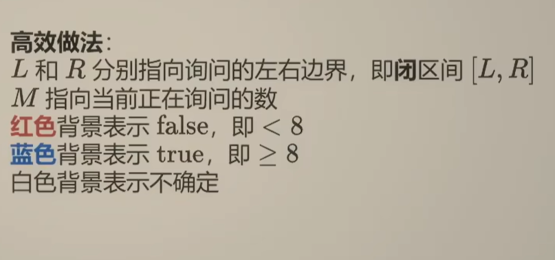

# 二分查找

二分查找边界处理的思想 
1 固定左闭右闭的编程习惯（一般return r）
2 思考当区间只剩下1，2个元素的时候，程序是否会死循环


```C++
  while (l<=r)
        {
            int mid=l+(r-l)/2;
            if (check)
             {
             
             }
             else if ()
             {
                l=mid+1;
             }
             else
                r=mid-1;
        }
        return r;

```
